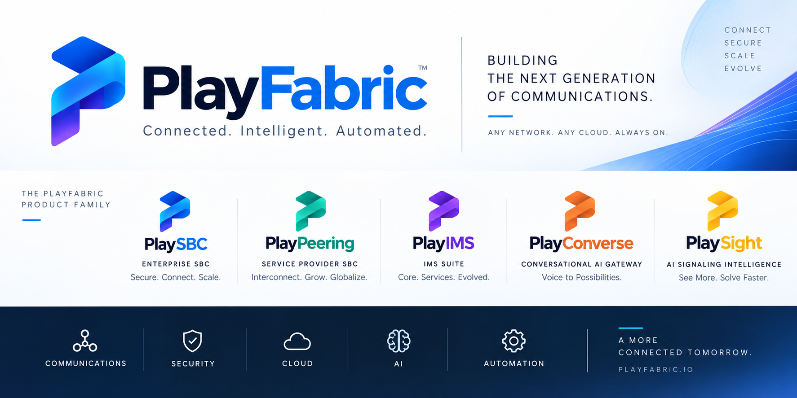

<p align="center">
  <br>
  
</p>

<p align="center"><strong>A serious SBC lab where SIP, RTP, and AI voice learn to behave before real calls do.</strong></p>

<p align="center">
  
  
  
  
  
  
</p>

PlaySBC is a Python SIP/RTP lab for B2BUA routing, G.711 media, RTPengine, HA experiments, AI voice, observability, and evidence-driven SIPp regression. It is an engineering and validation platform, not yet a production-certified SBC.

## Start Here

| Goal | Guide |
| --- | --- |
| Choose the correct workflow | [Documentation index](docs/README.md) |
| Read the product and administration guide | [PlaySBC v3.0.0 Product Guide](output/pdf/PlaySBC-v3.0.0-Product-Guide.pdf) |
| Copy commands in a browser | [PlaySBC v3.0.0 Browser Guide](output/html/PlaySBC-v3.0.0-Product-Guide.html) |
| Understand kind/minikube topology | [Local Kubernetes lab](docs/KUBERNETES_LOCAL.md) |
| Run Rasa voice/chat profiles | [AI Voice Gateway](docs/AI_VOICE_GATEWAY.md) |
| Configure and test hold, transfer, or forwarding | [RFC 5359 business calling services](docs/BUSINESS_CALLING_SERVICES.md) |
| Use Grafana and Prometheus | [Observability](docs/OBSERVABILITY.md) |
| Review planned work | [Evolution plan](docs/EVOLUTION_PLAN.md) |
| Inspect release artifacts | [Release index](release/README.md) |

## Current Release

- Version: `3.0.0`
- Release: <https://github.com/sudheerkumarvatrapu/PlaySBC/releases/tag/v3.0.0>
- Helm: `playsbc-3.0.0.tgz`
- Images: `playsbc`, `playsbc-rtpengine`, `playsbc-k8s-regression`, and `playsbc-sipp` under `ghcr.io/sudheerkumarvatrapu`
- Security: CodeQL, Dependency Review, Trivy, and Checkov in GitHub Actions

Local kind/minikube must track the current release (`v3.0.0`) unless a compatibility run intentionally pins an older version.

## Architecture

```text
Core SIP endpoint
      |
      v
PlaySBC active-active pair
      |
      v
Paired RTPengine media anchors
      |
      v
Peer SIP endpoint / Rasa AI route

Prometheus <- metrics -> Grafana
Regression runner -> SIPp core/peer agents -> combined HTML/PCAP evidence
```

Local full regression defaults to two PlaySBC and two RTPengine replicas. AKS readiness regression intentionally defaults to one PlaySBC and one RTPengine to keep the cloud smoke lane focused and affordable. HA experiments are run locally unless cloud behavior is specifically under test.

## Quick Validation

Clone the repository and run the Docker regression suite:

```bash
git clone https://github.com/sudheerkumarvatrapu/PlaySBC.git
cd PlaySBC

PYTHONPYCACHEPREFIX=/private/tmp/playsbc-pycache \
python3 tools/run_regression_suite.py \
  --skip-sipp-smoke \
  --all-b2bua-profiles \
  --timeout 420
```

Report:

```text
logs/reports/latest.html
```

For deployment and administration, use the single maintained [PlaySBC v3.0.0 Product Guide](output/pdf/PlaySBC-v3.0.0-Product-Guide.pdf).

Verify the PlaySBC and RTPengine images currently configured in either Deployment or StatefulSet topology:

```bash
kubectl -n playsbc get deployment,statefulset \
  -l 'app.kubernetes.io/instance=playsbc,app.kubernetes.io/name in (playsbc,playsbc-rtpengine)' \
  -o custom-columns='KIND:.kind,NAME:.metadata.name,IMAGES:.spec.template.spec.containers[*].image'
```

## Evidence Contract

Every applicable regression profile should produce:

- a clear verdict and SIP ladder
- `log.sip`, `log.media`, and `log.platform`
- one combined `sipmsg.log`
- one combined `capture.pcap` for non-load call profiles
- `pcap-legs.json` proving every expected capture role and both plain-SIP B2BUA INVITE legs
- codec, RTP/RTCP, transcoding, AI, or HA evidence required by that profile
- an HTML report that links or embeds the useful artifacts

## Production Status

PlaySBC has strong lab coverage, but large-scale production claims require external shared state, carrier-grade load balancing, security hardening, multi-node and multi-zone failure proof, long soak tests, and measured capacity baselines. See the [evolution plan](docs/EVOLUTION_PLAN.md).

PlaySBC v3.0.0 is a public MIT release. It brings the public runtime and evidence tooling to the 78-profile regression catalog, including unattended transfer and forwarding scenarios with paired RTPengine coverage. Private repository governance, credentials, generated evidence, and customer material are not part of this release.

## Cleanup

```bash
helm uninstall playsbc --namespace playsbc
kubectl delete namespace playsbc
```

## Contributor

[Sudheer Kumar Vatrapu](https://github.com/sudheerkumarvatrapu)

---

## Part of the PlayFabric Platform

<p align="center">
  
</p>
