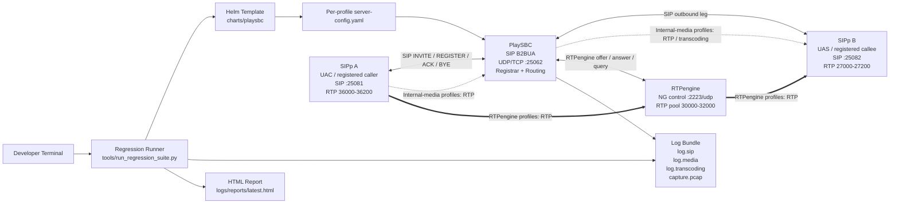
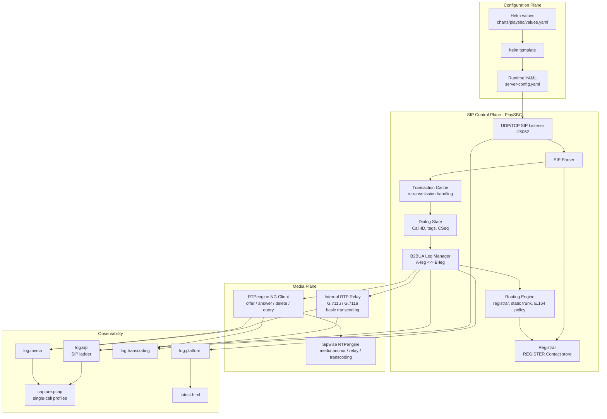
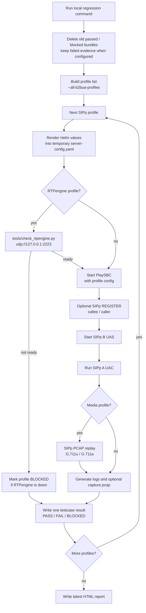
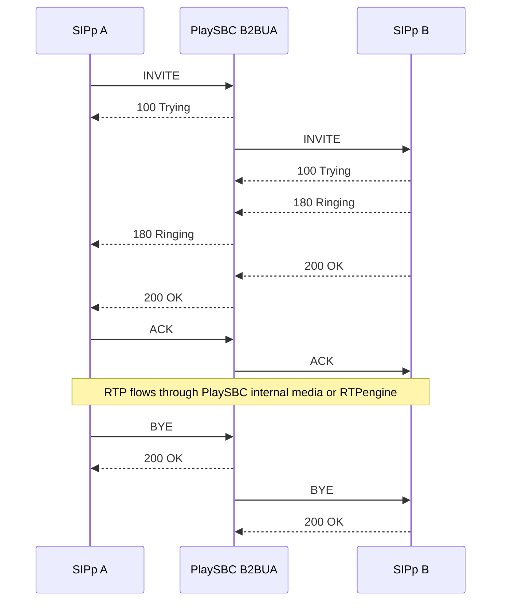

# PlaySBC Service Network Diagrams

These diagrams describe the current PlaySBC lab architecture: SIP/B2BUA control, optional RTPengine media anchoring, Helm-rendered configuration, and SIPp regression testing.

## High-Level Architecture

## Low-Level Service Network

## SIPp Regression Testing Network

Profiles run sequentially. Each profile gets its own Helm-rendered YAML config and one log bundle.

## Basic B2BUA Call Path

## Network Roles

| Service | Role | Default Local Ports |
| --- | --- | --- |
| SIPp A | Caller / UAC / registered caller | SIP `25081`, RTP `36000-36200` |
| PlaySBC | SIP registrar, router, B2BUA, logs | SIP `25062`, internal RTP `25100-25400` |
| SIPp B | Callee / UAS / registered endpoint | SIP `25082`, RTP `27000-27200` |
| RTPengine | Optional media backend / anchor | NG control `2223/udp`, RTP `30000-32000` |
| Helm | Config renderer for local and Kubernetes lab | `helm template` |
| Regression runner | Sequential SIPp profile orchestration | `tools/run_regression_suite.py` |

## Media Path Rule

- Core B2BUA profiles use PlaySBC internal media handling.
- RTPengine profiles keep SIP signalling in PlaySBC but move RTP anchoring to RTPengine.
- Load profiles avoid SIP ladders and PCAP clutter.
- Single-call profiles may include SIP ladders and `capture.pcap`.
