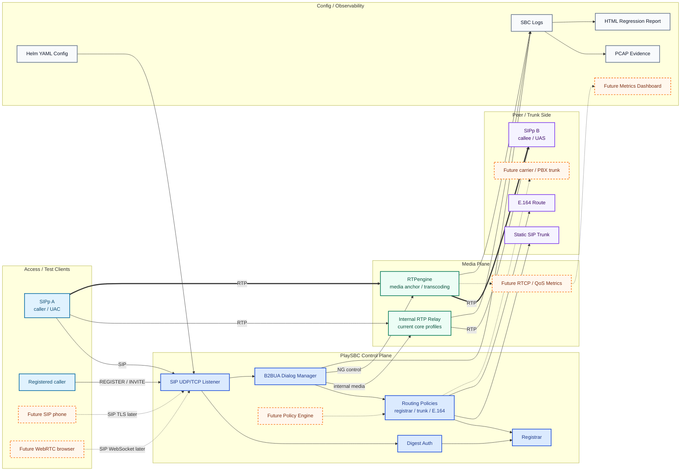
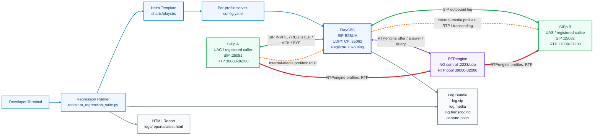
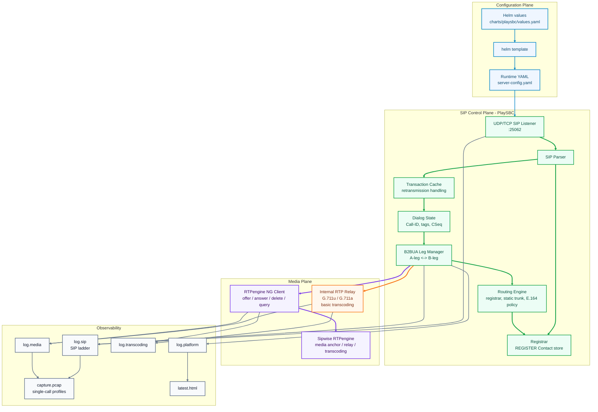
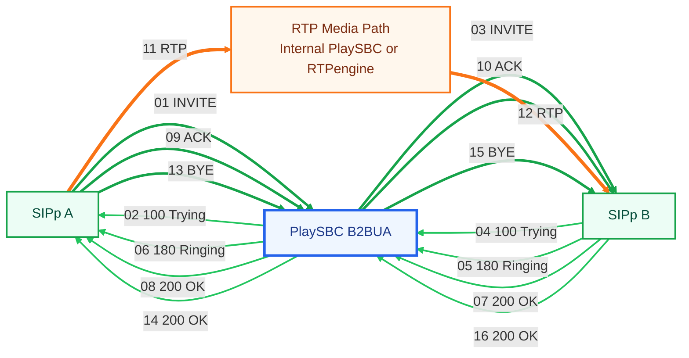
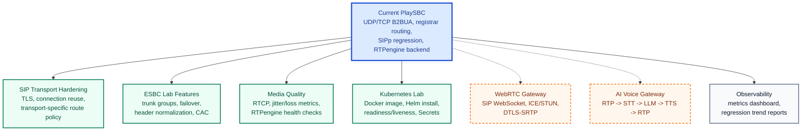

# PlaySBC Service Network Diagrams

These diagrams describe the current PlaySBC lab architecture: SIP/B2BUA control, optional RTPengine media anchoring, Helm-rendered configuration, and SIPp regression testing.

PDF version: [PlaySBC_Service_Network_Diagrams.pdf](PlaySBC_Service_Network_Diagrams.pdf)

## Color Key

| Color | Direction |
| --- | --- |
| Blue | Configuration/rendering flow |
| Green | SIP signalling |
| Orange | Internal RTP/media path |
| Purple | RTPengine NG control |
| Red | RTPengine anchored RTP/media path |
| Gray | Logs, PCAP, and reports |

## Broad Platform View

This is the larger picture: PlaySBC is the SIP/B2BUA control point, while media can be handled internally for lab profiles or delegated to RTPengine for SBC-style anchoring.



## High-Level Architecture



## Low-Level Service Network



## SIPp Regression Testing Network

Profiles run sequentially. Each profile gets its own Helm-rendered YAML config and one log bundle.

```mermaid
flowchart TD
    Start["Run local regression command"]
    Clean["Delete old passed / blocked bundles<br/>keep failed evidence when configured"]
    List["Build profile list<br/>--all-b2bua-profiles"]
    Profile["Next SIPp profile"]
    Render["Render Helm values<br/>into temporary server-config.yaml"]
    Preflight{"RTPengine profile?"}
    CheckRTPE["tools/check_rtpengine.py<br/>udp://127.0.0.1:2223"]
    Blocked["Mark profile BLOCKED<br/>if RTPengine is down"]
    StartServer["Start PlaySBC<br/>with profile config"]
    Register["Optional SIPp REGISTER<br/>callee / caller"]
    UAS["Start SIPp B UAS"]
    UAC["Run SIPp A UAC"]
    Media{"Media profile?"}
    PcapReplay["SIPp PCAP replay<br/>G.711u / G.711a"]
    Capture["Generate logs and optional capture.pcap"]
    Result["Write one testcase result<br/>PASS / FAIL / BLOCKED"]
    More{"More profiles?"}
    Report["Write latest HTML report"]

    Start --> Clean --> List --> Profile --> Render --> Preflight
    Preflight -- "yes" --> CheckRTPE
    CheckRTPE -- "not ready" --> Blocked --> Result
    CheckRTPE -- "ready" --> StartServer
    Preflight -- "no" --> StartServer
    StartServer --> Register --> UAS --> UAC --> Media
    Media -- "yes" --> PcapReplay --> Capture
    Media -- "no" --> Capture
    Capture --> Result --> More
    More -- "yes" --> Profile
    More -- "no" --> Report

    classDef runner fill:#eff6ff,stroke:#0284c7,color:#0c4a6e,stroke-width:2px
    classDef rtpe fill:#f5f3ff,stroke:#7c3aed,color:#3b0764,stroke-width:2px
    classDef blocked fill:#fef2f2,stroke:#dc2626,color:#7f1d1d,stroke-width:2px
    classDef sip fill:#ecfdf5,stroke:#16a34a,color:#064e3b,stroke-width:2px
    classDef media fill:#fff7ed,stroke:#f97316,color:#7c2d12,stroke-width:2px
    classDef report fill:#f8fafc,stroke:#64748b,color:#0f172a,stroke-width:2px

    class Start,Clean,List,Profile,Render runner
    class Preflight,CheckRTPE rtpe
    class Blocked blocked
    class StartServer,Register,UAS,UAC sip
    class Media,PcapReplay media
    class Capture,Result,More,Report report

    linkStyle 0,1,2,3,4 stroke:#0284c7,stroke-width:2px
    linkStyle 5,6,7,8 stroke:#7c3aed,stroke-width:2px
    linkStyle 9 stroke:#dc2626,stroke-width:3px
    linkStyle 10,11,12,13 stroke:#16a34a,stroke-width:3px
    linkStyle 14,15,16 stroke:#f97316,stroke-width:3px
    linkStyle 17,18,19,20,21 stroke:#64748b,stroke-width:2px
```

## Basic B2BUA Call Path



## Network Roles

| Service | Role | Default Local Ports |
| --- | --- | --- |
| SIPp A | Caller / UAC / registered caller | SIP `25081`, RTP `36000-36200` |
| PlaySBC | SIP registrar, router, B2BUA, logs | SIP `25062`, internal RTP `25100-25400` |
| SIPp B | Callee / UAS / registered endpoint | SIP `25082`, RTP `27000-27200` |
| RTPengine | Optional media backend / anchor | NG control `2223/udp`, RTP `30000-32000` |
| Helm | Config renderer for local and Kubernetes lab | `helm template` |
| Regression runner | Sequential SIPp profile orchestration | `tools/run_regression_suite.py` |

## Logical Node Examples

| Logical Node | Meaning | Example |
| --- | --- | --- |
| Developer Terminal | Local shell used to start checks and regression | `python3 tools/run_regression_suite.py --all-b2bua-profiles` |
| Regression Runner | Orchestrates profiles sequentially | Starts PlaySBC, SIPp B, SIPp A, then writes result |
| Helm Template | Renders lab config without requiring Kubernetes | `helm template playsbc charts/playsbc` |
| Per-profile Config | Temporary YAML used by one profile only | `media_backend: rtpengine`, `sip_transport: tcp` |
| SIPp A | Caller side, usually UAC | Sends `INVITE`, `ACK`, `BYE`; may send RTP PCAP |
| PlaySBC | SIP registrar, router, B2BUA, and log owner | Receives A-leg INVITE and creates B-leg INVITE |
| SIPp B | Callee side, usually UAS | Sends `100 Trying`, `180 Ringing`, `200 OK` |
| RTPengine | Optional media anchor/backend | PlaySBC sends `offer`, `answer`, `query` on UDP `2223` |
| Registrar | Stores REGISTER contacts | `callee -> sip:callee@127.0.0.1:25082` |
| Routing Engine | Chooses outbound target | Registrar lookup, static trunk, or E.164 policy |
| Internal RTP Relay | PlaySBC-owned media path for core profiles | G.711u/G.711a relay and basic transcoding |
| Log Bundle | One folder per testcase | `log.sip`, `log.media`, `log.transcoding`, `capture.pcap` |
| HTML Report | Regression summary | `logs/reports/latest.html` |

## Media Path Rule

- Core B2BUA profiles use PlaySBC internal media handling.
- RTPengine profiles keep SIP signalling in PlaySBC but move RTP anchoring to RTPengine.
- Load profiles avoid SIP ladders and PCAP clutter.
- Single-call profiles may include SIP ladders and `capture.pcap`.

## Future Enhancement View

The next target is to grow PlaySBC from a local B2BUA regression lab into a broader SBC experimentation platform.


